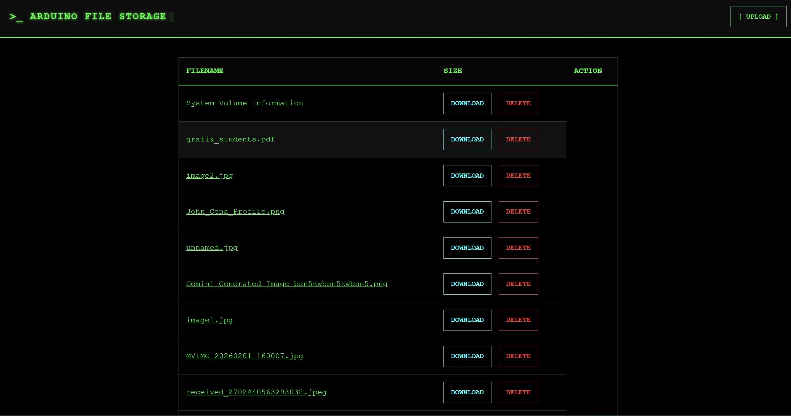
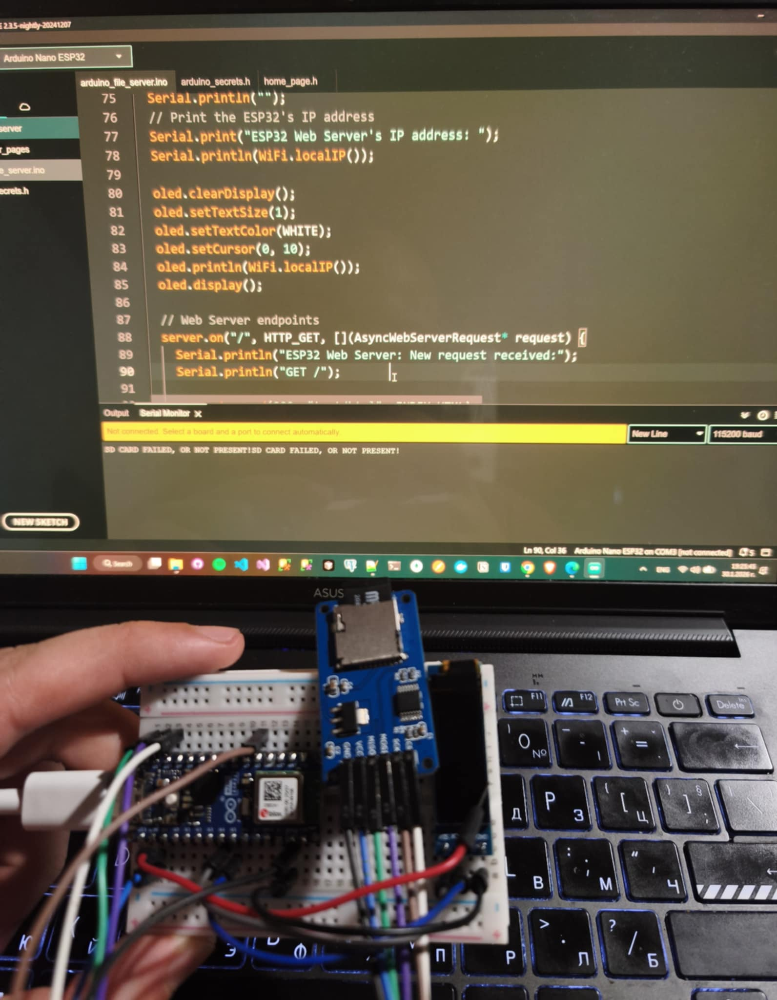

# 📂 Arduino Nano ESP32 WiFi File Storage

A compact, web-based file management system running entirely on an Arduino Nano ESP32. This project acts as a local server, allowing me to upload, download, delete, and preview files stored on an SD card via a clean HTML web interface.

## 🌟 Features

- **Web Interface:** Serves a fully functional HTML dashboard accessible via any browser on the local network.
- **File Management:**
  - **List:** View all files stored on the SD card.
  - **Upload:** Wireless file transfer from computer/phone to the SD card.
  - **Download:** Retrieve files from the SD card.
  - **Delete:** Remove unwanted files.
- **Image Preview:** Click on image filenames to view them directly in the browser.
- **Status Display:** 128x32 OLED screen shows real-time connection status and IP address.

## 🛠️ Hardware Components

- **Microcontroller:** Arduino Nano ESP32
- **Storage:** Micro SD Card Module + SD Card (formatted FAT32)
- **Display:** 0.91" OLED Display (128x32 I2C)
- **Prototyping:** Breadboard & Jumper Wires

## 💻 Libraries Used

1.  **`WiFi.h`** (Built-in to ESP32 core)
2.  **`SD.h`** (Built-in)
3.  **`Adafruit_SSD1306`** (and `Adafruit_GFX`) - For the OLED display.
4.  **`ESPAsyncWebServer.h`** - For the non-blocking web server.
    - _Dependency:_ `AsyncTCP`
